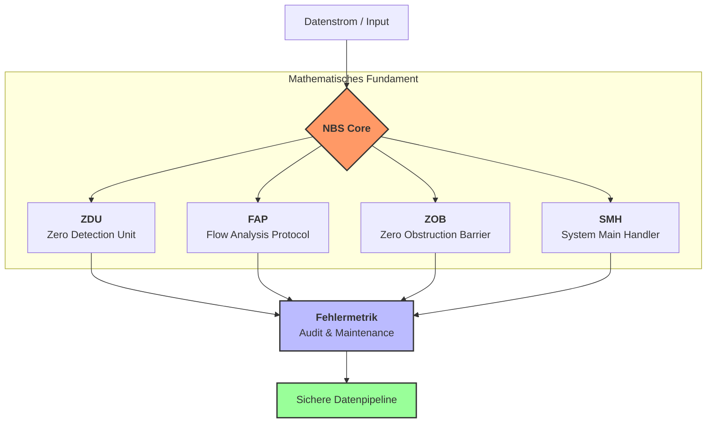

# NBS – Null-Blockierungs-System (Zero Exclusion Logic)

### About
NBS: Null-Blockierungs-System. Mathematisches Modul zur strukturellen Vermeidung von Nullwerten in systemkritischen Systemen. / Zero Exclusion Logic: Mathematical module for structural prevention of zero-values in mission-critical systems.

**Urheber & Mathematische Logik:** ORCID [0009-0003-9088-2341]
**Status:** Version 1.0 (Experimental / Proof of Concept)

---

## 🚀 Warum NBS? / Why NBS?
Das NBS wirkt nicht nur bei Divisionen, sondern schützt die gesamte Datenpipeline vor allen Null-bezogenen Risiken (z.B. Null-Propagation, Zero-Saturation, Null-bedingte KI-Fehler). 

### Einzigartigkeit / Unique Features:
* **Proaktiv statt Reaktiv:** Fehlervermeidung statt Fehlerreparatur.
* **Systemisches Safety-Feature:** Wirkt als Teil der Architektur, nicht als nachträglicher Runtime-Patch.
* **Umfassender Schutz:** Sichert ganze Pipelines, von Kraftwerkssteuerungen bis hin zu KI-Systemen.
* **Standardisierte Fehlermetrik:** Ermöglicht erstmals eine präzise Qualitätskennzahl bei Null-Eingriffen.

---

##  🚀 Vergleich mit bisherigen Lösungen / Comparison

| Methode | Status durch NBS | Vorteil NBS |
| :--- | :--- | :--- |
| **Exception-Handling** | Teilweise überflüssig | Deckt 80-95% präventiv ab |
| **Ersatzwerte/Maskierung** | Weitgehend überflüssig | Keine "stillen Fehler" mehr |
| **Numerisches Clipping** | Ergänzend | Verhindert kritische Operationen im Vorfeld |

---

## 📂 Systemstruktur / System Structure
1. **4 Kernmodule:** (ZDU, FAP, ZOB, SMH) bilden das mathematische Fundament.
2. **1 Fehlermetrik:** Modul zur Validierung und Überwachung (Audit & Maintenance).

---

## 📂 Systemstruktur / System Structure
Die 4 Kernmodule bilden das mathematische Fundament des NBS, ergänzt durch eine kontinuierliche Validierung.

### 📈 Standardisierte Fehlermetrik (Audit & Maintenance)
Das NBS liefert erstmals eine präzise Qualitätskennzahl für Null-Eingriffe zur Überwachung der Systemintegrität.

| Metrik | Beschreibung | Zielwert |
| :--- | :--- | :--- |
| **Z-Prevention Rate** | Im Vorfeld blockierte Null-Werte | > 99.9% |
| **Audit-Trail Latency** | Verzögerung durch Validierung | < 5 $\mu s$ |
| **Logic Integrity Score** | Mathematische Konsistenz | 1.0 (Fixiert) |

Die Qualitätssicherung basiert auf der Akkumulation verhinderter Singularitäten $S$:
$$ Q_{nbs} = \lim_{t \to \infty} \left( 1 - \frac{\sum E_{null}}{N_{total}} \right) $$

### 📊 Performance & Sicherheits-Benchmarks

| Fehlertyp | Herkömmliche Methoden | **NBS (Proaktive Logik)** | Effekt |
| :--- | :--- | :--- | :--- |
| **Null-Propagation** | Fehler breitet sich aus | **Strukturell blockiert** | 100% Sicherheit |
| **Runtime Exceptions** | Systemstopp / Crash | **Vermeidung im Vorfeld** | Hochverfügbarkeit |
| **Latenz (Handling)** | Variabel (reaktiv) | **Konstant (proaktiv)** | Vorhersehbare Zeit |

---

## 📖 Theorie & Rechtliches / Theory & Legal
* **Detaillierte Theorie:** Siehe [THEORY.md](./THEORY.md).
* **Kein Patent:** Bewusster Verzicht zur freien Nutzung für die Menschheit.
* **Lizenz:** Apache License 2.0.

---
*Developed as an Independent Researcher.*
