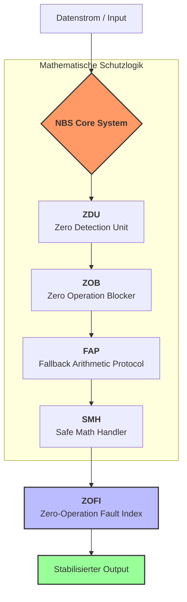

# NBS – Null-Blockierungs-System (Zero Exclusion Logic)

**Status:** Version 1.0 (Experimental / Proof of Concept)  
**Urheber:** [0009-0003-9088-2341](https://orcid.org)  
**Lizenz:** Apache License 2.0

---

## 🚀 Warum NBS?
Das **Null-Blockierungs-System (NBS)** ist eine revolutionäre mathematische Architektur zur strukturellen Vermeidung von Nullwerten in systemkritischen Prozessen. Im Gegensatz zum herkömmlichen Stand der Technik (reaktives Exception-Handling) greift NBS **proaktiv** ein, bevor numerische Fehler entstehen.

### Der entscheidende Unterschied

| Merkmal | Stand der Technik (Legacy) | **NBS (Innovation)** |
| :--- | :--- | :--- |
| **Zeitpunkt** | Reaktiv (nach dem Fehler) | **Präventiv (vor der Operation)** |
| **Ansatz** | Lokale Patches / Try-Catch | **Systemische Architektur** |
| **Fehlerfluss** | Unkontrollierte Propagation | **Kausale Blockierung** |
| **Messbarkeit** | Keine standardisierte Metrik | **ZOFI-Quantifizierung** |

---

## 📂 Systemstruktur / System Structure
Das NBS besteht aus vier deterministischen Kernkomponenten, die als modularer Sicherheits-Stack zusammenwirken.

### Die funktionalen Komponenten
1. **ZDU (Zero-Detection-Unit):** Deterministische Identifikation von Null-Zuständen vor der Ausführung.
2. **ZOB (Zero-Operation-Blocker):** Abfang-Einheit, die instabile Operationen kontextbezogen puffert.
3. **FAP (Fallback-Arithmetic-Protocol):** Entscheidungsprotokoll für das Systemverhalten (Ersatzwerte, Modifikation oder Safe-Mode).
4. **SMH (Safe-Math-Handler):** Ausführungseinheit für alternative, stabile Rechenpfade.

---

## 📈 Standardisierte Fehlermetrik: ZOFI
Der **Zero-Operation Fault Index (ZOFI)** ermöglicht erstmals die kausale Quantifizierung von Null-Operations-Fehlern.

### Definition
Sei ein numerischer Datensatz $X = \{x_1, x_2, \dots, x_n\}$. Die Gesamtanzahl nullbedingter Fehlerereignisse $E_{zero}$ (NaN, $\pm\infty$, explizite Nullen) führt zum Index:

$$ \boxed{\text{ZOFI}(X) = \frac{E_{\text{zero}}}{n}} $$

**Eigenschaften:** Dimensionslos, normiert auf $[0,1]$ und systemunabhängig vergleichbar.

---

## 🛠 Technische Lösung & Vorteile
*   **Fehlervermeidung statt Behandlung:** Verhindert NaN- und $\infty$-Propagation im Keim.
*   **Erhöhte Systemstabilität:** Reduziert Absturzraten in kritischen Pipelines (Medizintechnik, Flugsteuerung, KI-Training).
*   **Numerische Integrität:** Garantierte Fortführung komplexer Berechnungen ohne manuelle Eingriffe.

---

## 📂 Repository-Inhalt
* `/core`: Implementierung der Module ZDU, ZOB, FAP, SMH und ZOFI-Index
* `THEORY.md`: Detaillierte mathematische Herleitung und Beweisführung.
* `examples/`: Beispiel-Skripte für den Einsatz in KI- und Finanzsystemen.

---

## 🛡 Sicherheitsrelevante Anwendungen
Das NBS ist optimiert für Umgebungen, in denen numerische Instabilität katastrophale Folgen hat:
* **Finanzwesen:** Hochlast-Transaktionen ohne Division-durch-Null-Risiko.
* **KI & Deep Learning:** Schutz vor Modell-Kollaps durch "Zero-Saturation".
* **Industrie 4.0:** Sensor-Validierung in Echtzeit-Steuerungen.

---
*Erstellt im Sinne der technologischen Weiterentwicklung*

Licensed under the **Apache License 2.0**
---

## 🤝 Commercial Licensing & Hardware Partnerships

This repository serves as an open-source Proof of Concept (PoC) under the Apache License 2.0 to foster innovation and academic collaboration. 

However, for **industrial production, commercial integration, exclusive hardware manufacturing**, or deep-tech hardware implementation, alternative commercial licenses and joint patenting frameworks are available.

If you are a semiconductor foundry, hardware manufacturer, or financial tech institution interested in building physical PPU/Superchip hardware, please reach out for commercial licensing, joint development, or consultancy options.

**Contact:** Please open an **Issue** directly in this repository to initiate commercial licensing discussions or inquiries. / ORCID: 0009-0003-9088-2341

